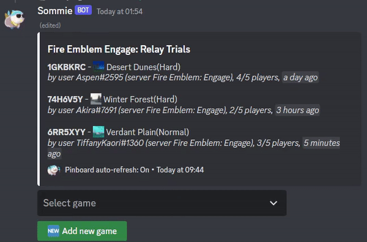
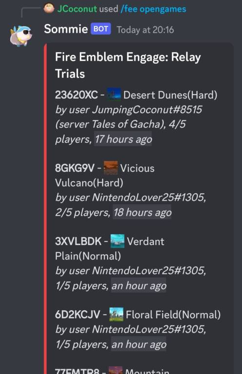
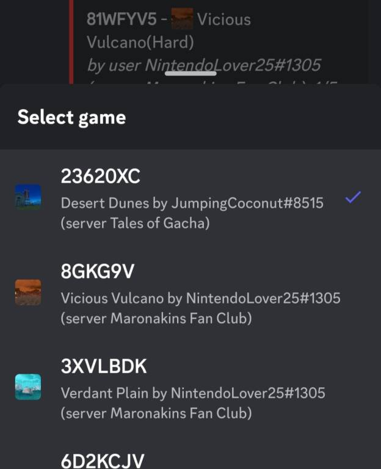
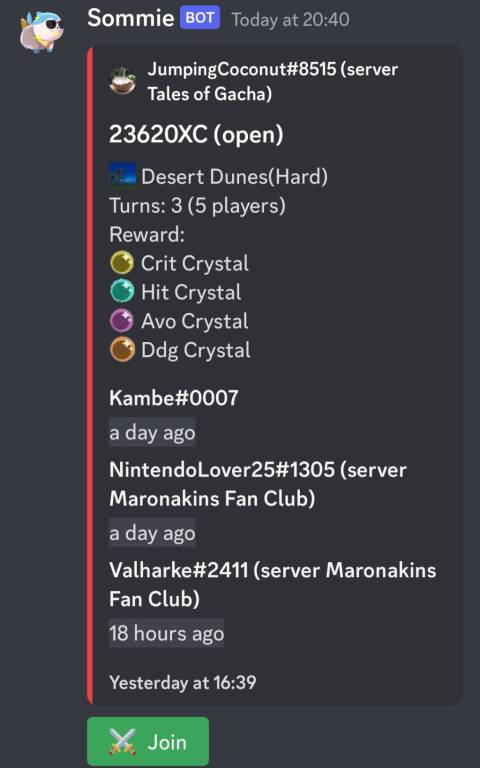
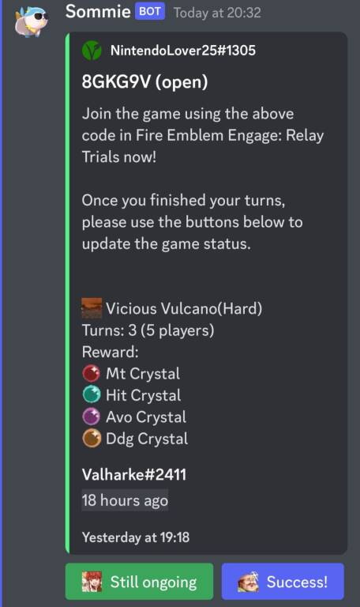
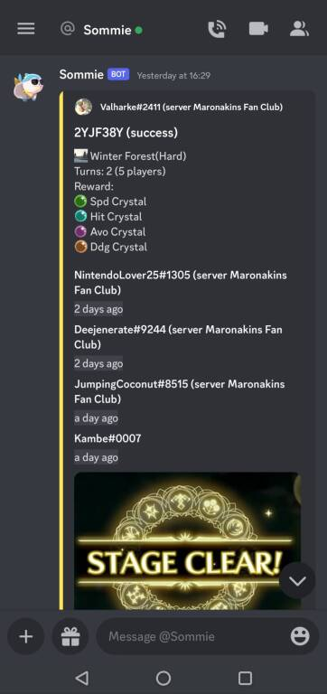
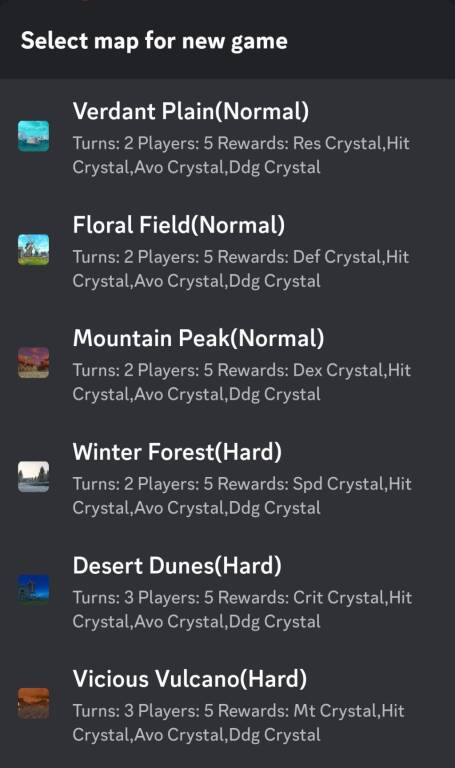

# Sommie, the Fire Emblem Engage coop Discord bot for Relay Trials
Discord bot for Fire Emblem Engage coop play. It is open source but I recommend you to just invite the existing bot, so we can share a database of open lobbies and not seperate further.

Invite to your server with https://discord.com/api/oauth2/authorize?client_id=1068580872162377780&permissions=414464731200&scope=bot

## Features

- Stores Fire Emblem Engage Relay Codes for Coop battles and lists them
- Sends info messages about new about open games if the user wants that
- Lists open games publically for everyone in the server or privately just for the user who requests it
- Can make one permanent, pinned message in your channel that auto-updates with information about all open games every time a new game gets added or changed
- No game ID gets lost, it is all saved in the list and not buried in chat
- Right click on chat messages and extract game IDs from them if you are too lazy to use the keyboard commands
- Immediately see how many people already joined a game already and how many open slots are left
- Overview of maps and rewards
- Finished games get removed automatically and every participant gets a message so they can claim their rewards
- Games with no updates after a certain time get removed automatically so we dont clog up the list with "dead" games, the author can chose to revive the game anytime if the system automatically removes it
- Dead games can be "voted out" by the users so waiting for the auto-cleanup is not even needed
- Make games visible to only your friends (cross-server) by giving a "group pass"
- Make games visible to only your server if you don't want to cooperate with other discord servers together to get games from them

## Usage for Mods and Server Owners

As a mod or server owner, you can use the /pinboard command to make the bot automatically watch your channel, and update it with a pinned message about all open games every time a new game gets added or a game status changes.

The users can use this pinned message to select games, participate in them, or use a simple button to add new games.

This means the users will have minimal interaction with the bot, and do not have to use chat commands. 

Only users with "Manage Messages" permissions can use the /pinboard command. Also, the bot needs to have "Manage Messages" permissions. Once the /pinboard command is sent by a mod once, everyone can interact with it, no special permissions required.

## Advanced Usage

With the command /fee coop [ID] you can to view, create or join a game. You and everyone else can use /fee opengames to see a list of games to join. These commands can be sent in any channel where the bot is, they can be sent in your own private 1-person discord server, and they can even be used just in private chat with the bot, completely without a discord server.

All games can be set up so that either everyone can see them (on ALL discord servers where the bot is). Or just everyone on your current server. Or, last option, give a pass please (for example "EirikasFriends") and then only people who know the passphrase see your games.

The bot is deliberately made with the option to ignore server boundaries so we don't need to join one big discord server with random people together. Everyone just uses the bot in their own little server of friends, and you exchange codes with everyone else who wants to share cross-server.

Short usage guide:

1. Show open games with /fee opengames

2. Select a game from the list

3. The bot will show game details like who else already took a turn and when:

4. After clicking join, you're expected to do the match. Afterwards you tell the bot if you won the map or not

5. Everyone profits once the map is done!

To make a game yourself, use /fee coop [ID].
Optionally you can give a password for the game or tell the bot to only show it on the current discord server.

For any questions or feature ideas, write me here or in discord. JumpingCoconut#8515

## Invite Link

- Sommie, https://discord.com/api/oauth2/authorize?client_id=1068580872162377780&permissions=414464731200&scope=bot
